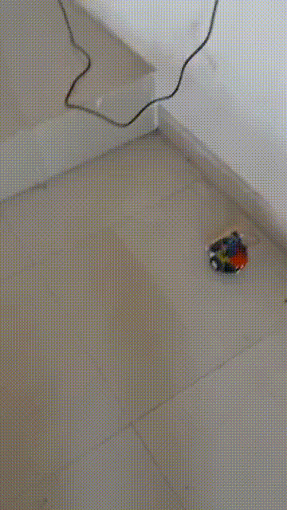

# Wall-Following Robot

A autonomous right-wall following robot using three ultrasonic sensors (front, left, and right). The robot moves forward while maintaining a safe distance from the right wall, adjusting its path if the wall is too close or too far (**bang-bang control**).

The program was tested on *AlphaBot2-Ar*, with two additional ultrasonic sensors mounted on the left and right sides to improve wall detection and corner navigation. The left sensor is currently not used in the control logic but is available for potential left-wall following or other applications.

## Working Principle

1. **Sensors**:
   - Three ultrasonic sensors measure distance to walls: front, left, and right.
   - The left and right sensors were mounted slightly forward (near the front) rather than at the center to improve corner detection.

2. **Control Logic (Bang-Bang)**:
   - **Too close to the right wall → steer left**
   - **Too far from the right wall → steer right**
   - **Front wall → turn left in place**
   - **Else → move forward**

3. **Turns**:
   - Steering turns (moving forward with slight speed difference between wheels) are used for curves and L-shaped outside corners.
    In-place turns are used for 90° sharp turns (inside corners) to prevent collision.

4. **Motor Speed Calibration**:
   - Forward speed and turn speed were adjusted through experimentation to maintain smooth wall-following and avoid overshooting.
   
## Demo

## Problems Faced
- **Sensor placement**: Initially, left and right sensors were at the center of the robot’s sides. This caused the robot to sometimes lose the wall and circle indefinitely when attempting right turns.
- **Turning strategy**:
  - Using only in-place turns for corners sometimes caused collisions due to sensor placement.
  - Resolved by using steering turns for L-shaped outside corners and in-place turns for sharp 90° inside corners.
- **Calibration of safe distances**: Safe distance thresholds for the front and right walls had to be carefully tuned to ensure the robot worked across different wall configurations.
- **Oscillation & overshooting**: Bang-bang control sometimes caused the robot to wobble along walls; careful speed adjustments minimized this effect.

## Assumptions
- The robot should initially start within the predefined safe distance from the right wall to ensure proper wall-following behavior.
- Robot operates in an environment with walls on the right side for guidance.
- Floor surface is even and provides sufficient traction for controlled turns.
- All sensors are functioning and mounted correctly (The left and right sensors are mounted toward the front corners of the robot, still facing directly left and right, to improve wall detection during turns).
- Bang-bang control for basic wall-following; no PID control is implemented.

